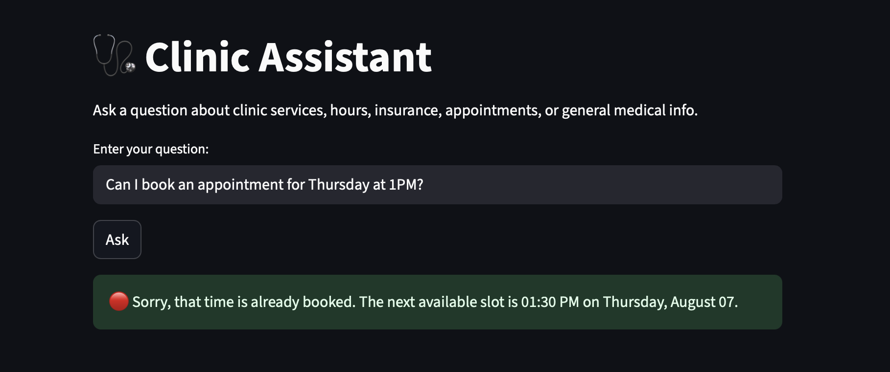

# 🩺 Clinic Assistant

An AI-powered assistant designed to handle a wide range of clinic-related queries and tasks, including general information, clinic FAQs, medical questions, and appointment scheduling.

The assistant supports:
- 🖥️ **Command-Line Interface (CLI)** usage
- 🌐 **Streamlit Web App** deployment (locally)

---

## 📸 Live Streamlit Interface:



---

## 🚀 Features & Capabilities

| Functionality        | Description |
|----------------------|-------------|
| **Query Classification** | Automatically determines if a question is about clinic hours, insurance, booking, clinic FAQs, or general medical topics. |
| **Clinic FAQ Answering** | Uses Retrieval-Augmented Generation (RAG) on a curated FAQ file to answer questions like:  
→ _“Do you take walk-ins?”_, _“Do you offer Pap smears?”_ |
| **Medical QA from PubMed** | Uses RAG on PubMed abstracts to respond to general medical questions such as:  
→ _“What are the latest treatment options for PCOS?”_ |
| **Clinic Hours Tool** | Returns operating hours from a rule-based logic.  
→ _“Are you open on Saturday?”_ |
| **Insurance Checker Tool** | Answers coverage-related questions.  
→ _“Do you accept Blue Shield PPO?”_ |
| **Appointment Booking** | Checks for Google Calendar availability and books appointments if slots are open.  
→ _“Can I book an appointment for next Thursday at 3pm?”_ |
| **Booking Confirmation + Logging** | Confirms booking and logs the event to Google Sheets with name, email, date, and time. |
| **Multi-step User Interaction** | For booking, the assistant prompts the user for name → email → confirmation interactively (in both CLI and web). |
| **CLI + Streamlit Compatible** | Fully functional across both platforms with adaptive logic. |

---

## 📁 Project Structure

| Folder/File                  | Purpose |
|-----------------------------|---------|
| `cli/`                      | CLI query handler and entry point (`clinic_assistant.py`). |
| `webapp/`                   | Streamlit app UI (`clinic_assistant_app.py`). |
| `router/`                   | Query classification logic. |
| `retriever/`                | RAG-based retrieval for clinic FAQs and PubMed corpus. |
| `tools/`                    | Tools for hours checking, insurance validation, and calendar booking. |
| `models/`                   | Folder where the Mistral `.gguf` model should be placed. |
| `data/`                     | Contains `clinic_faq.txt` and `pubmed_corpus.txt` used for retrieval. |
| `baseline_comparison/`      | Scripts + JSON for comparing assistant responses vs baseline GPT. |
| `requirements.txt`          | Python package dependencies. |
| `.gitignore`                | Prevents pushing sensitive or large files (e.g., credentials, model). |
| `README.md`                 | This documentation. |

---

## 🧠 Model Setup (Required)

The assistant uses the **Mistral-7B-Instruct-v0.2** model in `.gguf` format for local inference.

> This file is too large to be stored in the repo.

### ✅ To set it up:
1. Download from Hugging Face:  
   🔗 https://huggingface.co/TheBloke/Mistral-7B-Instruct-v0.2-GGUF
2. Choose this file:  
   `mistral-7b-instruct-v0.2.Q4_K_M.gguf`
3. Place it in the `models/` folder:
   
clinic-assistant/
├── models/
│ └── mistral-7b-instruct-v0.2.Q4_K_M.gguf

*   **`clinic assistant/`**
    *   `models/`
         *   `mistral-7b-instruct-v0.2.Q4_K_M.gguf`

---

## 🔐 Google API Setup (Calendar & Sheets)

To enable booking and logging:

### 1. Create OAuth Credentials:
- Go to: [Google Cloud Console](https://console.cloud.google.com/)
- Enable:
  - Google Calendar API
  - Google Sheets API
- Create OAuth credentials
- Download the `credentials.json` file
- Place it in the **project root**

> ⚠️ `credentials.json` is excluded from the repo via `.gitignore`. Each user must create their own.

---

### 2. Set Your Calendar and Sheet IDs:
In `tools/gcal_scheduler.py` and `tools/sheets_logger.py`, update the following lines with your IDs:

```python
# tools/gcal_scheduler.py
CALENDAR_ID = "your_calendar_id_here"

# tools/sheets_logger.py
SHEET_ID = "your_google_sheet_id_here"
```

## 💻 How to Run the Assistant

### 🖥️ Option 1: CLI
From project root, use the command line to ask any relevant query:

```bash
python cli/clinic_assistant.py --query "Can I book an appointment for Friday at 2pm?"
```

> You'll be prompted for name, email, and confirmation if booking is available.

This will:
- Route your query
- Handle name/email/confirmation step-by-step
- Log confirmed bookings to Google Sheets
- Show appointment links

### 🌐 Option 2: Streamlit App (Local)
To launch the interactive web app locally:

```bash
streamlit run webapp/clinic_assistant_app.py
```

> It opens an interactive web app where you can ask clinic-related questions and complete booking steps through the interface.

This lets users:
- Ask clinic-related or general medical questions
- Book appointments interactively
- View contextual answers retrieved via RAG
- Navigate multistep flows with form-based input

---

## 📊 Baseline Comparison

We compared the assistant to a standard GPT baseline across clinic-related tasks.

| Metric                 | Baseline GPT     | Clinic Assistant   |
|------------------------|------------------|---------------------|
| Domain Accuracy        | Medium           | ✅ High              |
| Appointment Booking    | ❌ Not Supported | ✅ Fully Supported   |
| FAQ & Policy Retrieval | Very Limited     | ✅ Full Coverage     |
| Medical Info Lookup    | Partial          | ✅ With PubMed       |
| Multi-Step Interaction | ❌               | ✅ Step-by-step      |

### 🔁 How to Reproduce Comparison

To rerun the same baseline evaluation, use:

```bash
python baseline_comparison/compare_responses.py
```

This generates and saves side-by-side answers for a set of clinic-related test questions. The assistant responses are evaluated against a GPT baseline using a rubric that includes coverage, relevance, and helpfulness.

You can view all comparison results in:

```bash
baseline_comparison/baseline_response_comparison.json
```

This file contains:
- Each input question
- Assistant and baseline responses

Overall, the assistant consistently outperforms the baseline in domain-specific accuracy, multi-step flows, and practical functionality. It's much more helpful and reliable across real-world clinic queries.

---

## 📦 Dependencies

Install all dependencies using:
```bash
pip install -r requirements.txt
```

Key libraries include:
- streamlit – UI interface
- transformers – for LLM wrappers
- sentence-transformers – for embeddings and retrieval
- llama-cpp-python – for local GGUF inference
- google-api-python-client, oauthlib – calendar and sheet APIs
- faiss-cpu – for vector search
- torch, numpy, pandas, etc.

---

## 💡 Notes

- ✅ `credentials.json` must be created by each user and is excluded from GitHub (`.gitignore`). Follow Google API setup instructions to generate one.
- ✅ You must manually update the following in your local version:
  - `tools/gcal_scheduler.py`: `CALENDAR_ID = "..."`  
  - `tools/sheets_logger.py`: `SHEET_ID = "..."`  
- ✅ You must download the Mistral model manually from Hugging Face:  
  [TheBloke/Mistral-7B-Instruct-v0.2-GGUF](https://huggingface.co/TheBloke/Mistral-7B-Instruct-v0.2-GGUF)  
  Save it in the `models/` folder.
- ✅ The assistant runs entirely offline, without any external LLM APIs.
- ❗ Deployment via Streamlit Cloud is not recommended, as hosting local `.gguf` models is unsupported and can cause performance issues. Run locally instead using instructions above.

--- 

## 📬 Contact

For questions or collaboration ideas, please reach out or open an issue on GitHub.
